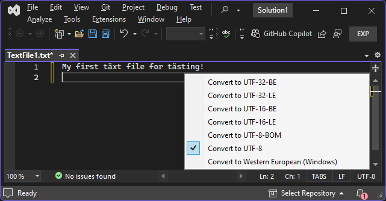

# UTFdefault

A Visual Studio extension that converts documents to UTF-8 without BOM on creation and opening in the editor if the document wasn't already encoded as UTF-8/16/32. The encoding is displayed at the bottom right of the editor view and can be converted with a click.

The extension targets Visual Studio 2022 (x86-64) and 2019 (x86-32).

